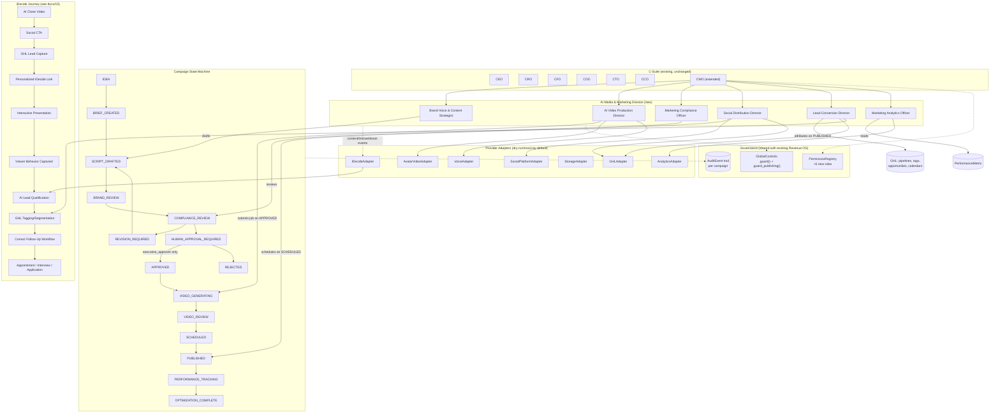

# 14 — AI Media & Marketing Division: Architecture

## Agent roster (extends the existing 13-agent C-Suite to 19)

| Agent | Reports to | Owns |
|---|---|---|
| CMO (extended) | CEO | Strategy, calendar balance, the 6 subordinates below, submission for approval — never publishes directly |
| Brand Voice & Content Strategist | CMO | Scripts/captions/hooks, structured from supplied facts only |
| AI Video Production Director | CMO | VideoGenerationJob lifecycle via AvatarVideoAdapter/VoiceAdapter |
| Marketing Compliance Officer | CMO | Risk scoring, prohibited-phrase blocking, mandatory-approval gating |
| Social Distribution Director | CMO | Per-platform SocialPost/PublishingJob, duplicate-publish prevention |
| Lead-Conversion Director | CMO | CTA → GHL pipeline/stage routing, LeadAttribution |
| Marketing Analytics Officer | CMO | PerformanceMetric collection, evidence-only OptimizationRecommendation |

## System diagram

## Data flow summary

1. CMO balances the weekly calendar against `content_mix.json` and assigns
   an idea to a content pillar + business + platform set.
2. Brand Voice & Content Strategist drafts a `ScriptVersion` from supplied
   `key_messages` only (never invents facts).
3. CMO brand-reviews, then Marketing Compliance Officer scores risk and
   determines the mandatory-approval gate.
4. `ApprovalQueue` (RBAC via `PermissionRegistry`) is the only path from
   `HUMAN_APPROVAL_REQUIRED` to `APPROVED` — a permission check succeeding
   is never confused with an actual approval (the state machine itself
   still gates the transition).
5. AI Video Production Director submits to `AvatarVideoAdapter` (consent
   required) once `APPROVED`.
6. Social Distribution Director schedules per-platform posts (dedup by
   content hash) once `VIDEO_REVIEW` passes.
7. Lead-Conversion Director routes resulting leads/contacts to the correct
   GHL pipeline/stage via `GHLAdapter`.
8. Marketing Analytics Officer collects `PerformanceMetric` (tagged by data
   quality) and produces evidence-based `OptimizationRecommendation`s —
   submitted for approval, never auto-applied.
9. iDecide (where confirmed usable — see docs/15) sits between step 6/7 and
   adds an interactive qualification layer feeding richer intent data back
   into step 7's routing decision.
